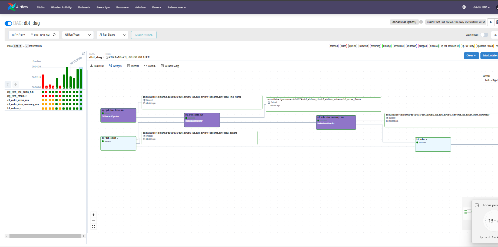

# A DBT-SNOWFLAKE-AIRFLOW PROJECT
The Goal of this project is simple. I had just completed a course on DBT and i needed to work on an Hands On Project to put to practice what i learnt. 
> Note : This is not a full scale ELT Project. It Focuses solely on the LT part of the ELT workflow.

## Table of Contents
- [Introduction](#introduction)
- [Project Architecture](#project-architecture)
- [Features](#features)
- [Installation](#installation)
- [Directory Structure](#directory-structure)
- [Data](#data)

## Introduction
A brief introduction to the project. Include:
- **Purpose**: Transforms Snowflake TPCH Data from it's staging area to Fact Tables and Data marts.
- **Summary**: It Solely focuses on the Loading(Snowflake), Transformation(DBT) and the Orchestration(Apache Airflow) of the Data Engineering Lifecycle.
- **Objective**: The overall goal of the project is to get a good grasps of working with DBT and Snowflake in a dev environment and also in Production.

## Project Architecture


## Features
The Key Features and Technologies involved include
- **Data Transformation** using DBT-CORE.
- **Data Source and Destination** Snowflake
- **Managing DBT Dags in Airflow** using Astronomer-Cosmos
- **AIrflow Environmnet using** Astronmoer
- **Automated Scheduling** with Airflow.


## Installation
1. **Prerequisites**: Python, Docker, Terraform, Astro
2. **Environment Setup**: Because of the Nature of this project. You'll need to configure your own snowflake credentials in the profiles.yml file in the dbt directory.
3. **Installation Steps**: 
Example:

```bash
# Clone the repository
git clone https://github.com/rhythmbear/dbt-snowflake-airflow-elt-pipeline.git dbt-snowflake-airflow

# Navigate to the project directory
cd dbt-snowflake-airflow

# Run Astro Airflow Environment.
astro dev start 
```
## Directory Structure.
```graphql
## General Directory Structure.
.
├── Dockerfile 
├── README.md
├── airflow_settings.yaml
├── dags
│   ├── dbt # Folder for housing DBT projects
│   ├── dbt_dag.py # DAG For Triggering DBT Project
│   ├── example_dag_advanced.py
│   └── example_dag_basic.py
├── include
├── packages.txt
├── plugins
├── requirements.txt
└── tests
    └── dags

6 directories, 9 files

```
```graphql
## DBT PROJECT STRUCTURE
.
├── README.md
├── analyses
├── dbt_packages
│   └── dbt_utils
├── dbt_project.yml
├── logs
│   └── dbt.log
├── macros
│   └── pricing.sql
├── models
│   ├── marts
│   └── staging
├── package-lock.yml
├── packages.yml
├── profiles.yml
├── requirements.txt
├── seeds
├── snapshots
├── target
│   ├── compiled
│   ├── graph.gpickle
│   ├── graph_summary.json
│   ├── manifest.json
│   ├── partial_parse.msgpack
│   ├── run
│   ├── run_results.json
│   └── semantic_manifest.json
├── tests
│   ├── fact_orders_date_valid.sql
│   └── fact_orders_discount_positive.sql
└── venv
    ├── bin
    ├── include
    ├── lib
    ├── lib64 -> lib
    └── pyvenv.cfg

19 directories, 18 files

```


## DAGS




